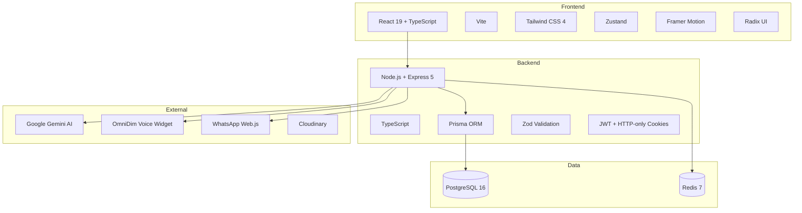
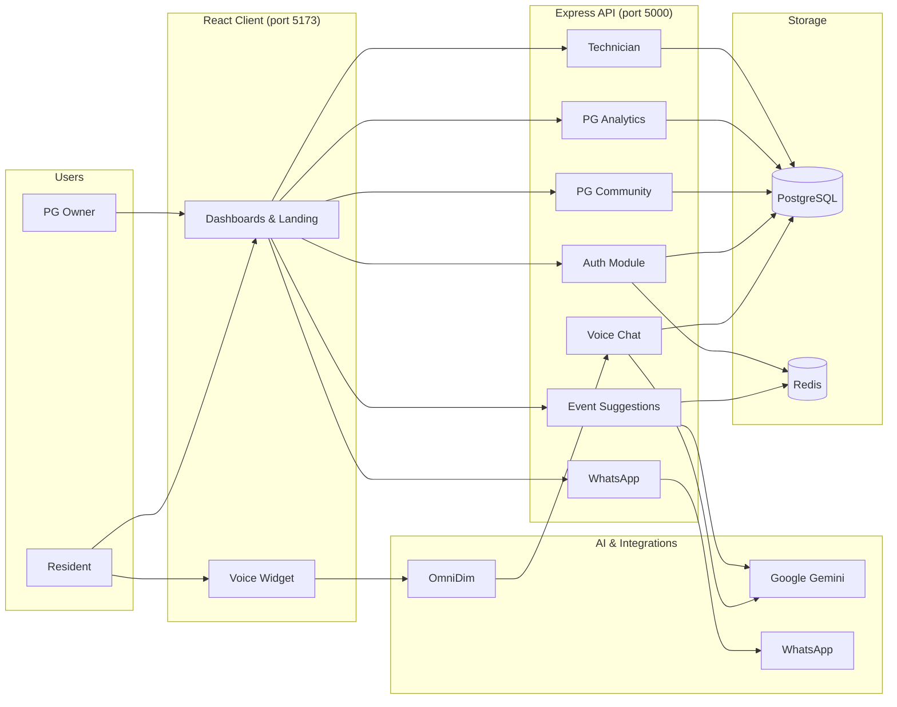
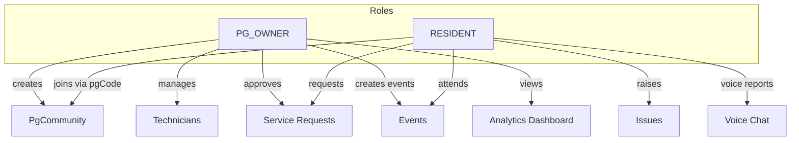
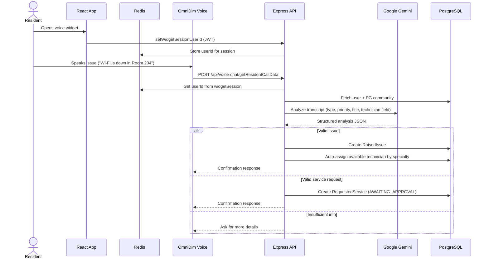
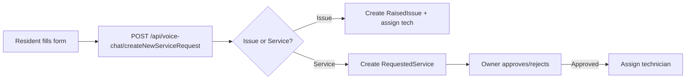
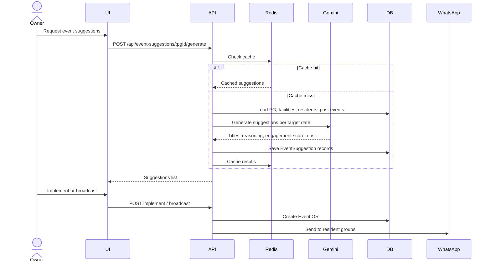
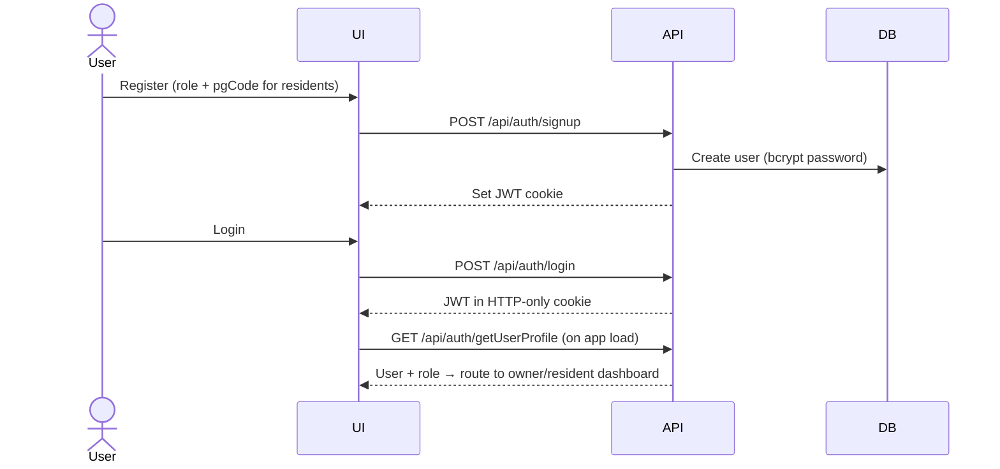
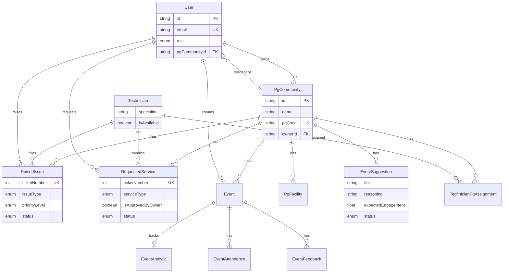
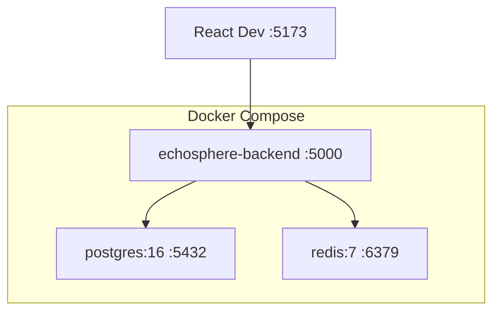

# Echosphere — Interview Guide

> **Use this doc** to walk interviewers through the project with diagrams, flows, and ready-made talking points.

---

## 1. Elevator Pitch (30 seconds)

**Echosphere** is an AI-powered community management platform for **PG (Paying Guest) accommodations**. Residents can **report issues by voice** — the system uses **Google Gemini** to understand the problem, auto-create tickets, and assign the right technician. PG owners get a full dashboard for issues, services, events, technicians, and **AI-generated community event suggestions** that can be broadcast via **WhatsApp**.

**One-liner:** *"Voice-first PG community ops — from complaint to ticket to technician, powered by AI."*

---

## 2. Problem & Solution

| Problem | How Echosphere solves it |
|---------|--------------------------|
| Residents report issues via WhatsApp/calls — no tracking | Structured tickets with status, priority, and history |
| Owners manually assign technicians | Auto-assignment by specialty (plumbing, electrical, etc.) |
| Low community engagement | AI suggests events based on PG context, past events, and calendar |
| No visibility into PG health | Analytics dashboard: issues, services, events, attendance, engagement |
| Slow manual service approvals | Owner approval workflow for non-urgent service requests |

---

## 3. Tech Stack



| Layer | Technology |
|-------|------------|
| **Frontend** | React 19, Vite, TypeScript, Tailwind CSS, Zustand, React Router |
| **Backend** | Node.js, Express 5, TypeScript, Prisma |
| **Database** | PostgreSQL 16 |
| **Cache / Sessions** | Redis (voice widget session, event suggestion cache) |
| **AI** | Google Gemini (`@google/genai`) |
| **Voice** | OmniDim voice widget → webhook to backend |
| **Messaging** | WhatsApp Web.js (event broadcasts) |
| **Auth** | JWT in HTTP-only cookies, bcrypt passwords |
| **Infra** | Docker Compose (app + Postgres + Redis) |

---

## 4. High-Level Architecture



---

## 5. User Roles & Access



| Role | Can do |
|------|--------|
| **PG Owner** | Create/manage PG communities, technicians, events; approve services; view analytics; broadcast AI event suggestions |
| **Resident** | Join PG via unique code; raise issues (voice/manual); request services; view own tickets and community events |

---

## 6. Core User Flows

### 6.1 Voice Issue Reporting (flagship feature)



**Talking point:** Gemini doesn't just summarize — it returns a **typed schema**: `isIssue`, `category`, `priority`, `requiredTechnicianField`, so the backend can route without hard-coded rules.

---

### 6.2 Manual Issue / Service Request



---

### 6.3 AI Event Suggestions



---

### 6.4 Authentication Flow



---

## 7. Database Schema (ER Diagram)



### Key enums interviewers may ask about

| Enum | Values | Why it matters |
|------|--------|----------------|
| `PriorityLevel` | P1–P4 | Drives urgency and alerts |
| `IssueStatus` | PENDING → ASSIGNED → IN_PROGRESS → RESOLVED | Ticket lifecycle |
| `ServiceStatus` | Includes AWAITING_APPROVAL, APPROVED, REJECTED | Owner gate for paid/extra work |
| `TechnicianField` | PLUMBING, ELECTRICAL, etc. | Auto-assignment matching |

---

## 8. API Overview

Base URL: `http://localhost:5000/api`

| Module | Prefix | Key endpoints |
|--------|--------|---------------|
| **Auth** | `/auth` | `signup`, `login`, `logout`, `getUserProfile`, `setWidgetSessionUserId` |
| **PG Community** | `/pg-community` | CRUD, `code/:pgCode`, `my-communities`, `my-community`, stats, residents |
| **PG Analytics** | `/pg-analytics` | Dashboard, issues, services, events, activities, event-analytics |
| **Voice Chat** | `/voice-chat` | `getResidentCallData` (webhook), `createNewServiceRequest` |
| **Event Suggestions** | `/event-suggestions` | `generate`, `broadcast`, `implement` |
| **Technician** | `/technician` | CRUD, assign to PGs, workload, import from other PGs |
| **WhatsApp** | `/whatsapp` | QR auth, group listing, event broadcast |

---

## 9. Project Structure

```
Echosphere-main/
├── client/                    # React frontend
│   └── src/
│       ├── app/               # Pages, layout, feature components
│       ├── pages/             # Owner & Resident dashboards
│       ├── services/          # API clients (axios)
│       ├── store/             # Zustand state
│       └── components/ui/     # Reusable UI (shadcn-style)
│
├── server/                    # Express backend
│   └── src/
│       ├── modules/
│       │   ├── auth/
│       │   ├── pgCommunity/
│       │   ├── pgAnalytics/
│       │   ├── voiceChat/     # Gemini + ticket creation
│       │   ├── eventSuggestion/
│       │   ├── technician/
│       │   └── whatsappWeb/
│       ├── middleware/        # auth, validation, errors
│       └── lib/               # prisma, redis, googleGemini
│
├── docker-compose.yml         # Postgres + Redis + App
└── INTERVIEW_GUIDE.md         # This file
```

**Pattern:** Feature-based modules — each has `routes → controller → service → validation`.

---

## 10. Docker Deployment



```bash
# Start backend + DB + Redis
docker compose up --build

# Frontend (separate terminal)
cd client && npm run dev
```

---

## 11. Key Design Decisions (good interview answers)

### Why Gemini for voice analysis?
- Voice transcripts are unstructured. Gemini returns **validated JSON** (issue vs service, category, priority, technician specialty) so we avoid brittle keyword matching.

### Why Redis?
- **Widget session:** OmniDim webhook doesn't carry JWT — we map `widgetSession → userId` in Redis after the resident opens the widget.
- **Event suggestions cache:** AI calls are expensive; cache per PG community.

### Why HTTP-only cookies for JWT?
- Safer than localStorage (XSS-resistant). Frontend uses `withCredentials: true`.

### Why separate Issue vs Service?
- **Issues** = problems to fix (auto-assigned).
- **Services** = requests that may need **owner approval** (cleaning, upgrades) before work starts.

### Why Technician–PG junction table?
- One technician can serve **multiple PG communities** (owner can import/share technicians).

### Modular backend
- Each domain (auth, analytics, voice, events) is isolated — easy to test and extend.

---

## 12. Demo Walkthrough Script (~5 min)

1. **Landing page** — Explain value prop: voice tickets, AI events, dashboards.
2. **Register as PG Owner** — Create a PG community (gets unique `pgCode`).
3. **Add technicians** — Show specialty fields and QR codes.
4. **Register as Resident** — Use `pgCode` to join the PG.
5. **Voice report** — Open widget, say *"AC not working in Room 12"*.
6. **Show ticket** — Issue created, technician auto-assigned, priority set.
7. **Owner dashboard** — View issues, analytics, approve a service request.
8. **AI events** — Generate suggestions → implement one → optional WhatsApp broadcast.

---

## 13. Sample Interview Q&A

**Q: What was the hardest part?**  
A: Linking the voice webhook to the correct logged-in user. Solved with Redis session mapping when the widget opens.

**Q: How do you handle bad AI output?**  
A: Zod/Gemini schema validation, `hasValidInformation` flag, and fallback when category or location is missing.

**Q: How would you scale this?**  
A: Queue voice webhooks (Bull/BullMQ), move WhatsApp to official Business API, add read replicas for analytics, cache dashboard aggregates in Redis.

**Q: Security considerations?**  
A: JWT in HTTP-only cookies, bcrypt passwords, role-based route guards (`PG_OWNER` vs `RESIDENT`), Zod input validation, Prisma parameterized queries.

**Q: Why Prisma?**  
A: Type-safe queries, migrations, clear schema for complex relations (User ↔ PG ↔ Technician ↔ Issues).

**Q: What would you add next?**  
A: Push notifications, mobile app, payment integration for services, SLA timers for P1 issues, admin panel for multi-PG operators.

---

## 14. Metrics & Analytics (what the dashboard tracks)

- **Issues:** count by status, priority, type, resolution time
- **Services:** approval rate, completion time
- **Events:** registrations, attendance rate, no-shows, ratings
- **Event analytics:** engagement score, ROI estimate, success factors
- **Technicians:** workload per PG, availability

---

## 15. Features Checklist (for quick reference)

- [x] Role-based auth (Owner / Resident)
- [x] PG community management with unique join codes
- [x] Voice-to-ticket via OmniDim + Gemini
- [x] Manual issue/service forms
- [x] Auto technician assignment by specialty
- [x] Owner service approval workflow
- [x] Technician CRUD + multi-PG assignment + workload
- [x] Event creation & resident attendance
- [x] AI event suggestions with caching
- [x] WhatsApp event broadcast
- [x] Analytics dashboards (owner + resident)
- [x] Dockerized deployment

---

## 16. Quick Stats to Mention

| Metric | Value |
|--------|-------|
| Backend modules | 7 feature modules |
| DB models | 12+ Prisma models |
| User roles | 2 (PG_OWNER, RESIDENT) |
| Priority levels | 4 (P1–P4) |
| Technician specialties | 8 fields |

---

## 17. Links & Files to Point To in Code

| What | Where |
|------|-------|
| App entry & routes | `server/src/index.ts` |
| DB schema | `server/prisma/schema.prisma` |
| Voice + Gemini logic | `server/src/modules/voiceChat/voiceChat.service.ts` |
| Event AI | `server/src/modules/eventSuggestion/eventSuggestion.service.ts` |
| Frontend routing | `client/src/App.tsx` |
| Owner dashboard | `client/src/pages/Owner/OwnerDashboard.tsx` |
| Resident dashboard | `client/src/pages/Resident/ResidentDashboard.tsx` |

---

*Good luck with your interview — use the mermaid diagrams in GitHub, VS Code (with Mermaid extension), or [mermaid.live](https://mermaid.live) to render them as visuals during screen share.*
